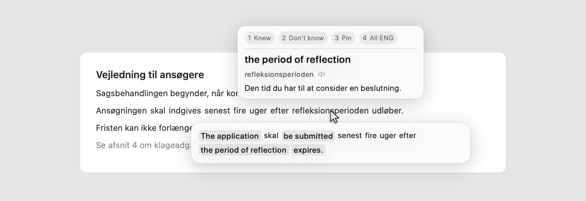

  <picture>
    <source media="(prefers-color-scheme: dark)" srcset="docs/images/logo-dark.png">
    
  </picture>

<h1 align="center">Babelstårnet</h1>

<strong>Hover any Danish word. Get the meaning. Keep reading.</strong>

  <picture>
    <source media="(prefers-color-scheme: dark)" srcset="docs/images/hover-dark.png">
    
  </picture>

Rendered from the app's own interface constants.

Babelstårnet is a local-first macOS translator for Danish. Point at a word
anywhere on screen — a website, a PDF, a form, text inside an image — and its
meaning appears where you are already looking. Nothing to select, paste, or
submit.

## The idea

**Danish carries the sentence; English fills only the gaps.** Word order and
grammar stay Danish, and so does every word you can already read. Only the words
you cannot read are swapped for English, in place — so you get one line to read
rather than two texts to reconcile.

**Which words those are is learned, not asked.** The app remembers what keeps
coming back to you, and hands each word back in Danish as you learn it. That is
the only progress signal there is: no lessons, no score, nothing to answer.

**Nothing leaves your Mac.** No screenshot, recognized text, definition, or audio
is sent to a remote service.

## Install

Requires macOS 15 or newer. Download the latest ZIP from
[Releases](https://github.com/Sininliny/Babelstaarnet/releases), open it, and
drag **Babelstaarnet.app** to **Applications**. The app is ad-hoc signed rather
than notarized, so the first launch is a Control-click on it, then **Open**.
Then:

1. Click **Set up Babelstårnet**.
2. Enable Babelstårnet in the System Settings page that opens — it needs Screen
   Recording permission to read what is on screen.
3. Relaunch the app if macOS asks.
4. Click **Start translating**, or press `Fn+Z`.

No account, terminal, or engine installation required. Preview builds are not
signed with an Apple Developer ID, so macOS may need you to Control-click the app
and choose **Open** once.

## Use

Press `Fn+Z` to start reading, and again to stop. Hover a Danish word: its
meaning appears above the pointer, and the whole line below it.

| Key | Does |
| --- | --- |
| `1` | Mark the word **known** |
| `2` | Mark it **unknown** and show more English |
| `3` | Pin the bubbles |

You never have to press any of them. Hold Option to keep a bubble open while you
move the pointer to it; every shortcut is editable under **Settings →
Shortcuts**.

---

**[How it works →](docs/HOW_IT_WORKS.md)** — the recognition pipeline, the design
rules behind the bubbles, building from source, and the optional open-source
engines.

“Babelstårnet” is Danish for “the Tower of Babel.” The repository keeps the ASCII
spelling `Babelstaarnet`.
